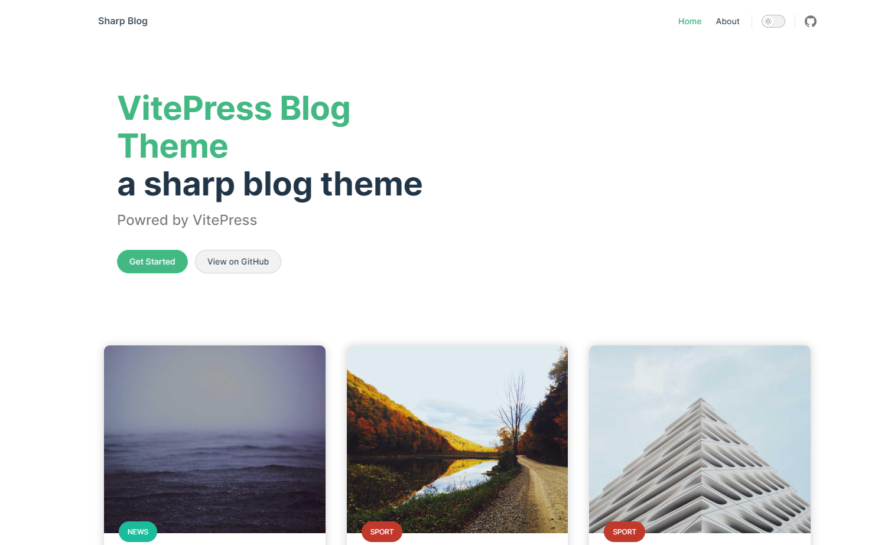
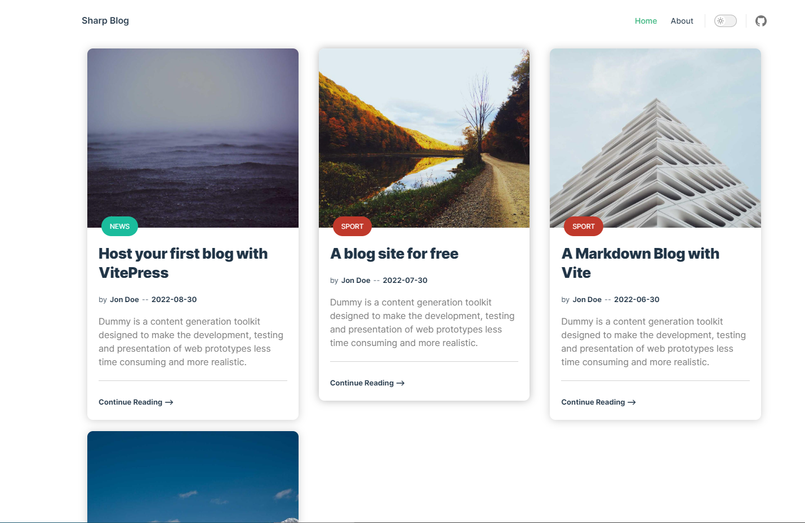

# ✒️ SharpBlog | A vitepress theme🌟
SharpBlog is VitePress' theme, built on top of VitePress.


[](https://github.com/ahdbk/vitepress-blog-sharp/actions/workflows/CI.yml)
[](https://app.netlify.com/sites/vitepress-blog-sharp/deploys)

Hey all 👋 !!

SharpBlog is [VitePress](https://vitepress.vuejs.org/)' theme, built on top of [VitePress](https://github.com/vuejs/vitepress).

this the is build on vitePress alpha stage. It is already suitable for out-of-the-box documentation use, but the config and theming API may still change between minor releases.

[Demo here](https://vitepress-blog-sharp.netlify.app/)

## 📷 Screenshot
   
   

## 📔 Documentation
## Development Setup

You will need [npm](https://nodejs.org/) or [yarn](https://yarnpkg.com/cli/install)

### Install

```sh
$ yarn install
```
### Build

```sh
$ yarn build
```
### Start Blog

```sh
$ yarn dev
```
### Project structure
```
blog
├─ .vitepress
│  ├─ theme
│  └─ config.js
├─ pages
│  └─ about.md
├─ posts
│  ├─ first-post.md
│  ├─ second-post.md
│  └─  ...
├─ server
│  └─ server.js
│  └─ index.md
└─ package.json
```

- All posts goes in the **posts** folder.
- Posts will be fetched and parsed automaticlly in the **server.js** file
- The theme follow the basic [VitePress](https://vitepress.vuejs.org/) project structure with a [.vitepress](https://github.com/ahdbk/vitepress-blog-sharp/tree/main/.vitepress) folder that contain the theme and blog [config.js](https://github.com/ahdbk/vitepress-blog-sharp/blob/main/.vitepress/config.js) file

for mere information please check the [official documentation](https://vitepress.vuejs.org/)
### Post Markdown file
All blog's posts are under the **Blog/posts** folder.
We are using fronmatter format to collect some metadata and have the needed visual

A post can have: 
- a title
- a date 
- an author 
- a category with custom color
- a cover 
- a description 

> **Warning**
**date**,**author** and **discription** are hidden from the UI of not present in the article metadata
**cover** image will display a random image if not present

Example of a markdown header for an post 
```markdown
---
layout: doc
date: 2022-08-30
title: Host your first blog with VitePress
author: Jon Doe
category: News
categoryColor: "#1abc9c" // default to gray

cover: /assets/cover.jpg

description: Dummy is a content generation toolkit designed to make the development, testing and presentation of web prototypes less time consuming and more realistic.
---

# you content here 

....
```
> **Warning**
If you are using a local asset as cover image. the image needs to go under the `public` folder.
Note that you should reference files placed in public using root absolute path - for example, `public/icon.png` should always be referenced in source code as `/icon.png`. for more details please check the official documentation for [asset handling](https://vitepress.vuejs.org/guide/asset-handling#public-files) 


### Deploy

Please refert to VitePress official documentation for [deployment and configuration](https://vitepress.vuejs.org/guide/deploying)

## 🙌 Contribution

Please make sure to read the [Contributing Guide](https://github.com/ahdbk/vitepress-blog-sharp/blob/main/contributing.md) before making a pull request.


## License
[MIT](https://github.com/vitepress-blog-sharp/blob/main/LICENSE)
